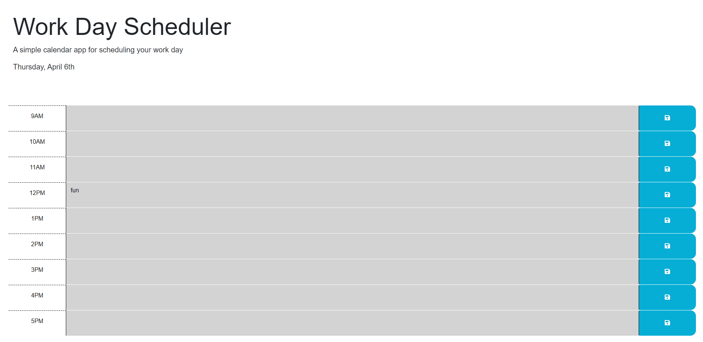

# Kajian-Work-Day-Scheduler

Website Mock-up made by 2023 edX Boot Camps LLC. Confidential and Proprietary. All Rights Reserved.

My first Work Day scheduler. From the starter code that was given to me, I had the challenge of coding a 9-5 work day schedule. When you open the application, if the colour is grey that means its in the past, red means its in the present, and finally green means its in the future. You can add tasks for the day and it will help with your time management. On the top of the page it shows the current date. I made my own HTML code after viewing the starter code and made the javascript portion for it. For installing my project you just need to clone this code to your repository. Project by Kajian Pulenthirasingam.

The link to the project:https://kajianpulenthirasingam.github.io/Kajian-Work-Day-Scheduler/
The link to the repository: https://github.com/kajianpulenthirasingam/Kajian-Work-Day-Scheduler

